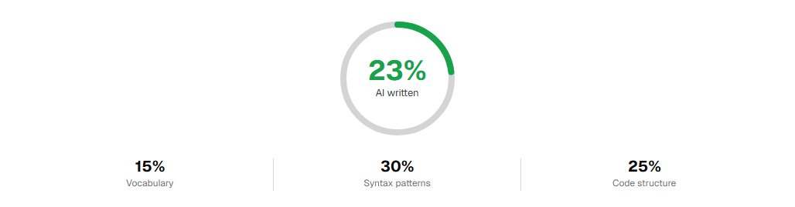

<h1>Project Proofs & Development Logs</h1>

Comprehensive proof of work, screen recordings, timelapses, and development progression for the <strong>Gameup-leveler</strong> hackathon entry.

---

## Important Hackathon Notice <!-- omit in toc -->

> [!IMPORTANT]
> This is a hackathon project created for [Manware](https://www.youtube.com/@IAmManware) as part of a specific challenge topic.
> This document serves as the official **Proofs Page**, detailing video logs, timelapses, integration stages, and downloadable release evidence to provide transparent, verifiable proof of project creation.

---

## Table of Contents

* [Important Hackathon Notice](#important-hackathon-notice)
* [Video Demonstrations & Evidence Release](#video-demonstrations--evidence-release)
* [Development Stage Recordings](#development-stage-recordings)
* [Integrity & Attribution Statement](#integrity--attribution-statement)
* [Project Commits & Progression Summary](#project-commits--progression-summary)

---

## Video Demonstrations & Evidence Release

### 📦 Official GitHub Evidence Release
All raw development screen recordings are published and directly downloadable from GitHub Releases:

* 🔗 **Download / View Proofs**: [GitHub Evidence Release Assets](https://github.com/sarimgamerop-cloud/Gameup-leveler/releases/tag/evidence)

### 🎬 Frontend Development Timelapse
A complete session recording capturing the interface construction, custom SVG wallpaper generation, KDE-inspired window mechanics, and the interactive 2D canvas plot engine:

* 🔗 **Google Drive Link**: [Frontend Timelapse (Watch on Google Drive)](https://drive.google.com/file/d/1azWzhnCxOg0SAMtjGqrQIOBAwiNE3biq/view)
* **Summary**: Covers layout structuring, icon grid snapping logic, Konsole terminal styling with Sweet/Candy color themes, ANSI sequence parsing, and responsive canvas projection.

* You can also see some of the detection results, if you find some else, it may be from minor ai assistance:

---

## Development Stage Recordings

The following video proofs document the live workflow, architecture sessions, and debugging stages recorded during development (available in the [GitHub Evidence Release](https://github.com/sarimgamerop-cloud/Gameup-leveler/releases/tag/evidence)):

| File Name | Phase / Milestones Covered | Details & Focus |
| :--- | :--- | :--- |
| **`creating_backend_procedures.mkv`** | Backend Logic & Archetype Math | Building `backend_procedures.py`, structuring the 6 gaming archetypes (*Collector*, *Creator*, *Competitor*, *Strategist*, *Explorer*, *Socializer*), and preparing 15 multi-choice questions with balanced coordinate vectors. |
| **`backend_and_frontend_integration.mkv`** | Integration Pipeline | Bridging Python backend definitions into browser-executable JavaScript, creating `test_converter.py` to auto-compile question structures into `questions.js`, and connecting the quiz runner. |
| **`testing_and_modification_process.mkv`** | Terminal Logic & Interactive Plot Testing | Tuning the Konsole terminal session inside `app.js` and `quiz.js`, verifying ANSI progress bars, testing real-time user input validation (A–F options), and verifying vector aggregation math in `plot.js`. |
| **`more_debugging_and_finals.mkv`** | Polish, UI Edge Cases & Final Fixes | Canvas pan/zoom gesture optimizations, double-click reset checks, desktop taskbar syncing, and final styling touches. |

---

## Integrity & Attribution Statement

* **Core Development**: All systems—including desktop window manager, snapping icons, bash emulator, quiz state machine, and 2D canvas plotter—were coded and integrated specifically for this hackathon submission.
* **AI Assistance**: As noted across the repository, Claude was used in an assistive capacity to polish edge cases, assist with question phrasing tweaks, and refine minor code details. The underlying concept, user flow, custom canvas projection math, and Arch Linux desktop rice aesthetics were conceptualized and built directly by the team.

---

## Project Commits & Progression Summary

| Commit Tag / Phase | Key Accomplishments |
| :--- | :--- |
| `Phase 1: Concept & Setup` | Initialized desktop shell with canvas background, wallpaper SVG gradients, and custom KDE/Arch visual assets. |
| `Phase 2: Question & Archetype Design` | Drafted gamer archetype coordinates and question sets in `backend_procedures.py`. |
| `Phase 3: Integration Bridge` | Wrote `test_converter.py` to export Python dictionary data into `questions.js` with center-of-mass coordinate algorithms. |
| `Phase 4: Simulated Terminal Engine` | Developed custom Konsole UI with full ANSI coloring, dynamic resize reflow, command execution (`./quiz`, `ls`, `cd`, `pwd`), and interactive CLI quiz flow. |
| `Phase 5: Canvas Plot & Final Polish` | Implemented 2D coordinate plotting in `plot.js` with interactive panning, mouse wheel zooming, affinity percentages, and nearest-archetype indicator links. |

---

<strong>Gameup-leveler — Hackathon Submission Proofs</strong>

Documented with verified development timelapses and live recordings.

